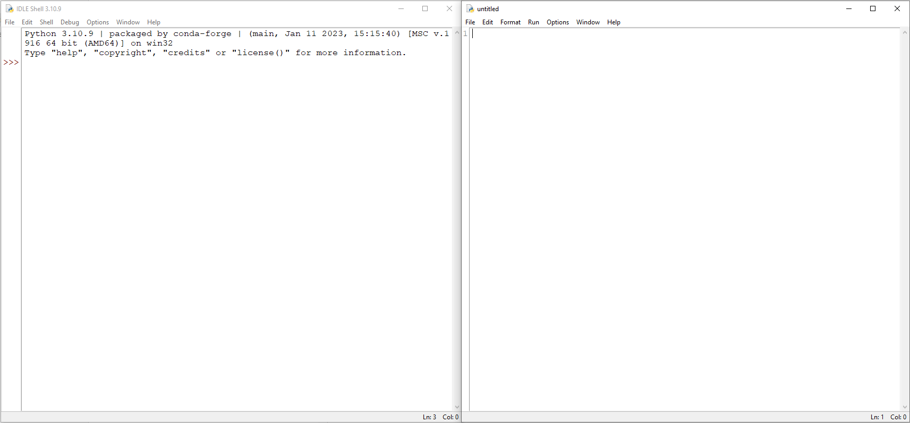
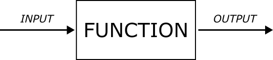
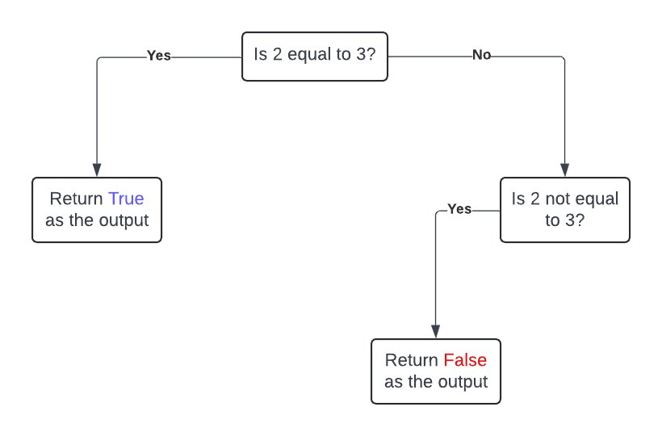

[[Training Schedule]]
## Session 1
### Why use coding in Geomorphology?
Digital literacy offered through coding boot camps are becoming increasingly popular as a means to secure job opportunities ([[Nambiar2020]]). The earth sciences have a long history of embracing programming with the potential of AI in solving geographical problems being debated as early as the 1980s (e.g. [[Smith1984]]). The realization that computers will play an important role in processing geographic data dates bake even earlier (e.g. [[Kao1963]]).

In the 1990s, the field of geocomputation started to emerge ([[Couclelis1998]]). Although a universally agreed upon definition is elusive, geocomputation can be viewed as the application of a computational paradigm to geographical problems ([[Openshaw2014]]). An important part of geocomputation, that is derived from its emphasis on the incorporation of a computational paradigm, is computational thinking.

Computational thinking involves the following ([[Beecher2017]]): picking out the essentials of a problem, formulate a problem in such a way that a computer can understand it, and follow a problem solving process in a way that the process can be automated. Some of the core concepts in computational thinking are include logical thinking, algorithmic thinking, problem decomposition and process evaluation ([[Beecher2017]]). Logical thinking relies heavily on an understanding of deductive logic and is often used in conditional statements (such as loops) where the flow of a program is directed. Algorithmic thinking involves expressing a task as a collection of individual sequential steps. Related to this idea is problem decomposition where a complex problem (or task) is broken down into smaller parts that can be understood and solved individually. Lastly, process evaluation involves whether the proposed solution can solve the problem in an efficient and effective manner.

### Why use Python?
There are many different programming languages that can be used to solve geographic problems, so much so that the choice of which language to use seems almost arbitrary. There are several key considerations when choosing which programming language to use are. First, how easy is the language to learn (assuming you do not have experience with it). Second, what are the financial implications of using the language (i.e. is it free or paid). Third, what existing libraries or packages are available (which will result in a substantial saving of time by not reinventing the wheel). Fourth, how well is the software documented (how clear are the instructions on using packages/libraries) Fifth, how big is the user community (this will determine how easy it is to get help on problems).

Python scores well on all of these since it is a free software that is widely considered to be a good entry-level language to learn, it has extensive packages on a variety of tasks, the documentation, for the most part, is very extensive (the only exception is smaller packages submitted by user in the community). Python also has an extensive user community and finding help online is very easy. Python is a high-level (human readable) programming language ([[McGrath2018]]), which essentially means that it is further "removed" from the machine code that CPUs need in order to function. In effect, python automates keeping track of data and variables which frees the user to focus on solving the problem using the steps discussed earlier. An additional benefit is that python is portable and can run on a wide range of hardware and different OS ([[McGrath2018]]) (even on Android).

Additionally, python is currently ranked first on both the TIOBE and PYPL indices indicating that it is a very popular programming language with plenty of tutorials. It is also considered to be a valuable career expanding option that opens the doors for work in data science and artificial intelligence (https://onlinedegrees.sandiego.edu/careers-using-python/).
### Creating and using virtual environments.
In order to use python effectively virtual environments need to be created. Python has been around for a long time and because of this, different versions of packages may interfere or prevent other packages of performing as intended. Virtual environments were developed to mitigate this issue. In a sense, a virtual environment functions as separate python installations, that exists as separate directories in your computer's directory tree, where different versions of packages can be installed ([[Vaughan2023]]). This effectively isolates them from other versions thereby preventing potential conflicts. Ideally, each one of your projects should have its own virtual environment ([[Vaughan2023]]). You can also share your environments with others, making it possible for them to perfectly reproduce your projects ([[Vaughan2023]]). This is becoming increasingly important in research.

There are two ways in which virtual environments can be created. The one works solely with "vanilla" python while the other uses anaconda (or more technically conda which is bundled with anaconda). For this module, we will be using the later since it is easier to carry out the process and to navigate between the different environments. Anaconda is not a different programming language, but rather just a python distribution that uses conda as its package manager. Python uses pip as its package manager and we will be making use of both.
#### Creating a virtual environment
The base environment is created by default when you install Anaconda, and it includes a Python installation and core system libraries and dependencies of conda ([[Vaughan2023]]). You should avoid installing other packages directly into your base environment ([[Vaughan2023]]) since this may cause conflicts at some point in the future. The command `conda create --name ENVNAME python=3.X` (where ENVNAME is the name of the virtual environment, and 3.X is the python version that should run in that environment) can be used to create a virtual environment (adapted from [[Vaughan2023]]).

---
**EXAMPLE**: Create a virtual environment named "data_analysis" that uses python 3.9.

```
conda create --name data_analysis python=3.9
```
---
#### Accessing a virtual environment
To enter a virtual environment, it needs to be activated. The command `conda activate ENVNAME` is used to access virtual environments while `conda deactivate`  is used to exit the current virtual environment and return to the base environment ([[Vaughan2023]]).

---
**EXAMPLE**: Access the environment you created in the previous step. Afterwards, leave the environment and return to the base environment.
```
conda activate data_analysis
conda deactivate
```

---
### Installing packages inside virtual environments
As stated earlier there are two package managers that can be sued: conda and pip. A package manager is, essentially, a piece of software that facilitates the installation of software onto the host system. It ensures that all of the dependencies are installed alongside the desired software. This makes it a lot easier for the user since they are not required to download the source files and compile the software onto their own systems. The easiest wat to install software is to search for the package online. It will usually be associated with either a pip or a conda command that can be copied to your terminal. For example, to install the pandas library, the following command needs to be entered into the terminal: `conda install anaconda::pandas`. You will then be provided with a series of prompts after which the package will be installed.

---
## Session 2
### The Python IDLE
There are many IDEs (Integrated Development Environments) available for python (such as PyCharm, Virtual Studio, Atom, Spyder etc). We will be using the IDE that ships with python (IDLE - Integrated Development and Learning Environment) in this module. To open the IDLE, the following command needs to be typed inside the terminal: `python -m idlelib`. Within the IDLE, programs code can either be executed line by line (similar to the terminal) or a separate file containing more intricate code can be run. We will start with just the terminal and later start using the separate file (also referred to as a script) to run our programs. The image below is an example of an IDLE with the terminal interface on the left and a blank file on the right.



---
### Introduction to programming concepts: variables, data types, operators, expressions.
#### The Zen of Python
The "Zen of Python" is a humorous collection of guidelines for programming in python (that do not always have to be followed). But if you are interested, more information can be obtained from https://realpython.com/zen-of-python/. 

```
>>> import this
The Zen of Python, by Tim Peters
 
Beautiful is better than ugly.
Explicit is better than implicit.
Simple is better than complex.
Complex is better than complicated.
Flat is better than nested.
Sparse is better than dense.
Readability counts.
Special cases aren't special enough to break the rules.
Although practicality beats purity.
Errors should never pass silently.
Unless explicitly silenced.
In the face of ambiguity, refuse the temptation to guess.
There should be one-- and preferably only one --obvious way to do it.
Although that way may not be obvious at first unless you're Dutch.
Now is better than never.
Although never is often better than *right* now.
If the implementation is hard to explain, it's a bad idea.
If the implementation is easy to explain, it may be a good idea.
Namespaces are one honking great idea -- let's do more of those!
```

#### Variables
Data is stored within the computer at specific locations of the system's memory. Each of these locations have an address (e.g. 0x7ffcc1a8a350). All the data you will be using when carrying out data analysis will be stored in one or more addresses in memory. To access a specific piece of information, you need to inform Python where in your system's memory the piece of information you are working with is stored. However, given the example of a memory address given above, this will be a cumbersome process. Therefore, variables were developed in order to make this easier.

Variables are names that are used to designate specific memory locations (the computer will create the actual memory address internally) ([[Forouzan2014]]). In python, there are a couple of rules when creating variable names ([[Matthes2023]]):
1. Variable names can only contain letters, numbers, and underscores.
2. They can start with a letter or an underscore, but they cannot start with a number.
3. Spaces are not allowed in variable names.
4. Avoid using Python keywords (e.g. `print`) as variable names.
5. Variable names should be short but descriptive.

---
**EXAMPLE** Here we create two variables (`var1` and `var2`) and obtain their memory addresses using the `hex()` and `id()` functions.
```
>>> var1 = 15
>>> var2 = "GGY 718"
>>> hex(id(var1))
'0x7ffcc1a8a350'
>>> hex(id(var2))
'0x1286bb30ef0'
```

---
#### Data types
Not all data are the same. Starting at a basic level, data can either be characters (i.e. letters or grammatical symbols), numbers (either integers or decimal numbers) or Boolean values (either true or false). These differences are significant enough that they determine what type of operations can be carried out on the data. 

In Python, the data type can be determines using the `type()` function. A string  (`str`) (such as a word or a sentence) is simply a collection of characters that are placed between matching closing brackets ([[Matthes2023]]) (either `''` or `""`). An integer (`int`) is a number without a fractional part ([[Forouzan2014]]) while a `float` is a number with a fractional part such as a decimal number ([[Matthes2023]]). Boolean (`bool`) can only be either `True` or `False` (take note of the capital letter since this is essential for Python to recognize the variable as being Boolean).  Boolean values are always used in conditional statements and are a key part of programming logic.

---
 **EXAMPLE** Determine the type of data for each of the following: "Geomorphology", 42, 42.0, True, and "True"
```
>>> type("Geomorphology")
<class 'str'>
>>> type(42)
<class 'int'>
>>> type(42.0)
<class 'float'>
>>> type(True)
<class 'bool'>
>>> type("True")
<class 'str'>
```
---

#### Operators
An operator is a language-specific token that requires an action to be taken ([[Forouzan2014]]). In other words, they are used to either carry out mathematical operations or to express relationships between one or more variables. As can be seen from the table below, the common operators can either be classified a being mathematical or logic, with the latter playing a role in flow control.

| Operator | Category | Description                         |
| -------- | -------- | ----------------------------------- |
| `+`      | Math     | Addition                            |
| `-`      | Math     | Subtraction                         |
| `*`      | Math     | Multiplication                      |
| `/`      | Math     | Division                            |
| `//`     | Math     | Division (floor integer)            |
| `%`      | Math     | Modulus (remainder)                 |
| `**`     | Math     | Exponent                            |
| `=`      |          | Assignment                          |
| `==`     | Logic    | Equality                            |
| `!=`     | Logic    | Not equal to                        |
| `>`      | Logic    | Greater than                        |
| `<`      | Logic    | Lesser than                         |
| `>=`     | Logic    | Greater or equal than               |
| `<=`     | Logic    | Less or equal than                  |
| `is`     | Logic    | Object identity                     |
| `is not` | Logic    | Negated object identity             |
| `and`    | Logic    | Used to combine multiple conditions |
| `or`     | Logic    | Used to combine multiple conditions |

---
**Example** 
```
>>> 5 + 2        # addition
7
>>> 5 - 2        # subtraction
3
>>> 5 * 2        # multiplication
10
>>> 5 / 2        # division
2.5
>>> 5 // 2       # division (floor integer)
2
>>> 5 ** 2       # exponent
25
>>> 1 == 1       # equality
True
>>> 1 == 2       # equality
False
>>> 1 != 2       # not equal to
True
>>> 2 > 1        # greater than
True
>>> 2 < 1        # less than
False
>>> 6 >= 2       # greater or equal to
True
>>> 6 <= 2       # less or equal to
False
>>> 5 is 2       # object identity
False
>>> 5 is 5       # object identity
True
>>> 5 is not 2   # negated object identity
True
>>> 5 is not 5   # negated object identity
False
```
---
#### Expressions
Formally, an expression is any sequence of operands and operators that reduce to a single value ([[Forouzan2014]]). For example, the expression `6 * 8 - 6` reduces to a value of `42` which is returned as the output.

---
### Data structures
Data structures are used to organize and store data in python to make the task of data processing easier ([[Vasiliev2022]]). Although there are many different types of data structures, python ships with four types of structure: lists, tuples, dictionaries, and sets ([[Vasiliev2022]]). We will look at these in this session.
#### Lists
Lists are ordered collections of items that are mutable ([[Vasiliev2022]]). By ordered it means that the sequence in which the items are entered into the list is considered relevant to python and it retains that order. Mutable means that the list can be altered after it was created (using either a method or a function). This includes adding items to a list.

Lists are created using square brackets `[]`. The items that are part of the list (i.e. its contents) are then placed between thee two brackets. Lists can contain either contain items of the same data type or can contain a mixture of different data types ([[Vasiliev2022]]). Lists can even contain other lists. This property is very useful since it allows for variables to be created that contain different types of data, for example rock lithology, aspect, surface temperature, and hardness readings.

It is also possible to retrieve a value within a list using an index value (in python these values start at 0, meaning that the first item in a list as an index of 0). List are indexed using the square brackets (`[]`). If a range of values are required, the list can be sliced using a colon as part of the index (i.e. `[:]`) where the starting index is to the left of the colon and the desired end index (+1) is to the right of the colon. 

Individual items within a list can be accessed using a `for` loop. In situations where a list contains other lists, a nested `for` loop (i.e. a `for` loop that is placed within another `for` loop) can be used to extract the individual items. List comprehension is a technique that is similar to a loop (just more compact) and allows for a new list to be created from an existing list based on some criteria ([[Vaughan2023]]).

The table below contains some useful methods that can be applied to lists (adapted from [[Vasiliev2022]], [[McGrath2018]]).

| Method                       | Description                                                  |
| ---------------------------- | ------------------------------------------------------------ |
| `my_list.append(x)`          | Add element x to the list named `my_list`.                   |
| `my_list.clear()`            | Removes all the items from `my_list`.                        |
| `my_list.count(x)`           | Counts the number of times element x appears in `my_list`.   |
| `my_list.extend(other list)` | Add all the elements of other list to the end of `my_list`.  |
| `my_list.index(x)`           | Find the index of element x in list `my_list`.               |
| `my_list.insert(i, x)`       | Insert element x into `my_list` at index i.                  |
| `my_list.pop(i)`             | Removes element from `my_list` at position i and returns it. |
| `my_list.remove(x)`          | Remove element x from list `my_list`.                        |
| `my_list.reverse()`          | Reverses all the items in list `my_list`.                    |
| `my_list.sort()`             | Sorts all the items in list `my_list`.                       |

---
**Example**
```
# the list below contain data on barchan dimensions published by Hamdan (2016)
>>> barchan_widths = [156.78, 176.6, 233.48, 157.37, 150.82, 231.11, 211.04, 171.17, 199.1, 383.75]

# The first value in this list is
>>> barchan_widths[0]
156.78

# Creating a slice of the data to retrieve the first 4 items
# remember the index of the fourth entry is 3
>>> barchan_widths[0:4]
[150.82, 156.78, 157.37, 171.17]

# Since it is mutable, we can rearrange it from low to high
>>> barchan_widths.sort()
>>> barchan_widths
[150.82, 156.78, 157.37, 171.17, 176.6, 199.1, 211.04, 231.11, 233.48, 383.75]

# create a new list that contain only values larger than 200
>>> barchan_widths_larger_200 = [i for i in barchan_widths if i >= 200]
>>> barchan_widths_larger_200
[211.04, 231.11, 233.48, 383.75]

# We can store data of different types
# The data contains name, Koppen classification, elevation and temperature
>>> site_data = ["Pretoria", ["C", "w", "a"], 1339, 18.7]

# We can index a list that is located within another list
>>> site_data[1][0]
'C'

# Adding rainfall data to site_data list
>>> site_data.append(732)
>>> site_data
['Pretoria', ['C', 'w', 'a'], 1339, 18.7, 732]

# using a for loop to print items in a list
>>> for i in barchan_widths_larger_200:
	    print(i)
233.48
231.11
211.04
383.75

# using a nested for loop to print items in a list containing lists
# the variable barchan barchan_dimension contains data on the length
# width and height of four barchans (from Hamdan (2016))

>>> barchan_dimension = [[139.02,207.45,19.75],[407.56,405.04,38.94],[413.26,380.14,36.52],[402.86,290.22,27.79]]
>>> for barchan in barchan_dimension:
	    print(barchan)
	    
[139.02, 207.45, 19.75]
[407.56, 405.04, 38.94]
[413.26, 380.14, 36.52]
[402.86, 290.22, 27.79]

>>> for barchan in barchan_dimension:
	    for dimension in barchan:
	        print(dimension)

139.02
207.45
19.75
407.56
405.04
38.94
413.26
380.14
36.52
402.86
290.22
27.79
```
---
#### Tuples
Similar to lists, tuples are organized collections of items ([[Vasiliev2022]]). However, they differ from lists in that they are immutable ([[Vasiliev2022]]). Immutable means that once a tuple is created, it cannot be changed afterwards.

Tuples are created using round brackets `()` where its contents are placed between the brackets. Tuples can also contain a variety of different data types and can be indexed in the same way as lists. The only methods that can be used on tuples are the ones that do not modify the tuple: `index()` and `count()`. Just like with lists, the values stored within tuples can be accessed using a `for` loop and items that are within tuples that are themselves stored within a tuple can be accessed using a nested `for` loop.

---
**Example**
```
# creating a tuple containing the dimensions (l,w,h) of a cut rock
>>> sample = (57,49.5,21.6)

# retrieve the width (index = 1)
>>> sample[1]
49.5

# add the colour to the list
>>> sample.append("brown")
Traceback (most recent call last):
  File "<pyshell#22>", line 1, in <module>
    sample.append("brown")
AttributeError: 'tuple' object has no attribute 'append'
```
---
#### Dictionaries
Dictionaries are mutable, unordered collections of key-value pairs ([[Vasiliev2022]]). Since they are mutable, it means that dictionaries can be altered after they have been created. Since they are unordered, it means that they are not typically used when ordering is important (although the order in which the data was entered is maintained). This is because dictionaries rely on key-value pairs to store and retrieve the data. The key is a unique identifier that is used to identify a specific value ([[Vasiliev2022]]).

Dictionaries are created using curly brackets `{}` where the key-value pairs are placed between the brackets. To retrieve the data, the key must be placed inside square brackets `[]`. This is similar to retrieving items from a list, except that you do not need to remember the index value, you just need to remember the key.

---
**Example**
```
# recreate the site data variable from earlier using a dictionary
>>> site_data_dict = {"name": "Pretoria", "koppen": ["C", "w", "a"], "elevation": 1339, "temp": 18.7, "rainfall": 732}

# retrieve the site's elevation
>>> site_data_dict["elevation"]
1339
```
---
### Sets
Set are collections of unordered unique items ([[Vaughan2023]]). The unique criterion means that duplicate items are not stored (even though they may be included when the set is created). Sets allow set operations (such as intersection and union) to be carried out ([[Vaughan2023]]). 

Like dictionaries, sets are created using curly brackets `{}`. However, unlike dictionaries, the items inside a set are not key-value pairs but just the items themselves. Some additional methods that can be used on sets are given below:

| Method                                            | Description                                                                                                                                                                       |
| ------------------------------------------------- | --------------------------------------------------------------------------------------------------------------------------------------------------------------------------------- |
| `my_set.add(x)`                                   | Add item x to `my_set`                                                                                                                                                            |
| `my_set.clear()`                                  | Removes all items from `my_set` (i.e. change it to an empty set).                                                                                                                 |
| `my_set.difference(another_set)`                  | Returns the items in `my_set` that are not present in `another_set`                                                                                                               |
| `my_set.difference_update(another_set)`           | Replaces the value of `my_set` with the results of the `difference()` method.                                                                                                     |
| `my_set.discard(x)`                               | Removes the item x from `my_set`.                                                                                                                                                 |
| `my_set.intersection(another_set)`                | Returns the items that occur in both `my_set` and `another_set`.                                                                                                                  |
| `my_set.isdisjoint(another_set)`                  | Returns `False` if `my_set` and `another_set` have common items. Returns `True` if they do not have common items.                                                                 |
| `my_subset.issubset(another_set)`                 | Returns `True` if `my_set` is a subset of `another_set`. It returns `False` otherwise.                                                                                            |
| `my_subset.issuperset(another_set)`               | Returns `True` if `my_set` is a superset of `another_set`. It returns `False` otherwise.                                                                                          |
| `my_set.pop()`                                    | Removes the item at index = 0 from `my_set`.                                                                                                                                      |
| `my_set.remove(x)`                                | Removes item x from `my_set`.                                                                                                                                                     |
| `my_set.symmetric_difference(another_set)`        | Returns the symmetric difference between `my_set` and `another_set` (i.e. items that are in both sets but which are not common to both sets). It is the opposite of intersection. |
| `my_set.symmetric_difference_update(another_set)` | Replaces the current value of `my_set` with the symmetric difference between `my_set` and `another_set`.                                                                          |
| `my_set.union(another_set)`                       | Returns a new set that represents the union between `my_set` and `another_set`.                                                                                                   |
| `my_set.update(another_set)`                      | Replaces the value of `my_set` with the union between `my_set` and `another_set`.                                                                                                 |

---
**Example**
```
# create a set of the lithologies considered in a study
# Note that slate has been added twice but only appears once
>>> lithologies = {"sandstone", "slate", "marble", "gabbro", "slate"}
>>> lithologies
{'marble', 'sandstone', 'gabbro', 'slate'}

# create two sets that contain the tombstone lithologies
# of two different cemetaries
>>> cemetery_1 = {"sandstone", "marble", "limestone"}
>>> cemetery_2 = {"limestone", "gabbro", "granite"}

# check which items are in cemetery_1 but not in cemetery_2
>>> cemetery_1.difference(cemetery_2)
{'sandstone', 'marble'}

# check which lithology occurs in both cemetery_1 and cemetery_2
>>> cemetery_1.intersection(cemetery_2)
{'limestone'}

# test if there are common lithologies between cemetery_1 and cemetery_2
>>> cemetery_1.isdisjoint(cemetery_2)
False # Yes, there are lithologies that occur in both cemeteries

# check which lithologies are not shared between cemetery_1 and cemetery_2
>>> cemetery_1.symmetric_difference(cemetery_2)
{'marble', 'gabbro', 'granite', 'sandstone'}

# check which litholgies were observed for both cemeteries combined
>>> cemetery_1.union(cemetery_2)
{'limestone', 'granite', 'sandstone', 'marble', 'gabbro'}
```
---
### Flow control using conditional functions
#### Functions and methods
Functions are named blocks of code that are designed to do one specific job ([[Matthes2023]]). A function maps an given input to an output ([[Forouzan2014]]). In other words, when you provide a function with an input (or a collection of inputs) it will return a specified output (or outputs) that are determined by the contained within the function. Therefore, a function can be visually seen as:



In order to use a function within your code, it must be called ([[Matthes2023]]). In Python a function call consists of the name of the function followed by round brackets and the inputs to that function. when the function is assigned to a variable, it means that the outputs of that function are assigned to that variable.

Methods are similar to functions but not the same thing. Methods are actions that a particular data type can perform ([[Vaughan2023]]). They can, therefore, perform the same role as a function but because they are tied to specific data types (or objects or data structures) they are not universal across these. For example, the string data type has a method `.capitalize()` which does not exist with floats. A float has a method `.as_integer_ratio()` which does not exist for strings.

---
**Example**
```
>>> random_numbers = [51,48,85,65,41]  #create a list of random numbers
>>> sum(random_numbers)                #use the sum function to add the numbers
290
>>> output = sum(random_numbers)       # output of the function assigned to variable
>>> output
290
>>> random_numbers.sort()              #use the sort method to sort the numbers
>>> random_numbers
[41, 48, 51, 65, 85]

>>> fraction = 3.25
>>> course = "ggy 718"
>>> course.capitalize()
'Ggy 718'
>>> fraction.as_integer_ratio()
(13, 4)
```

---
#### Conditional functions
As the term implies, conditional functions are functions that only run when a certain conditions, or set of conditions, are met. A condition is a statement that either evaluates to a `True` or `False` ([[Speight2020]]). In other words, a condition returns an output that is Boolean and based on this determines whether the functions that are associated with this conditional statement should be executed.

The `if` statement is used to evaluate a condition ([[Matthes2023]]). Note that the `if` statement only determines whether a given expression is `True` or `False`. If the expression is `True`, then the code following the `if` statement will be executed. When the `if` statement returns a `False`, then the code following the `if` statement will not be executed. In the example below, the `if` statement first determine whether the integer 2 is equivalent to itself. Since this statement is true, the code following the `if` statement (namely the `print()` function) is executed and the text appears on the screen. In the second example, the `if` statement evaluates whether the integer 3 is equivalent to the integer 2. Since this is not the case, the code following the `if` statement is not evaluated and therefore no output is produced.  

---
**Example**
```
>>> if 2 == 2:                        # evaluates if 2 is equivalent to 2
	print("The two numbers are equal")

The two numbers are equal
>>> if 3 == 2:
	print("The two numbers are equal")
                                      # since 3 is not equal to two, no output is
                                      # returned
>>>
```
---
#### elif statements
It is more common to use the `if` statement along with an `elif` statement (this is a shorthand for "else if"). The `if else` statement can be considered as an alternative to the first `if` statement. In other words, if the `if` statement evaluates to `False`, then python will skip the code following the `if` statement and go to the `elif` statement and evaluate it as being either `True` or `False`. Multiple `elif` statements can be used to provide any number of alternative options. The `else` statement can also be used to execute code that does not meet any of the conditions in the previous statement(s).

---
**Example**
```
if 2==3:
    print("True")
elif 2!=3:
    print(False)

False
```
---

The code above can be visualized as a flow diagram that shows the conditions under which the two functions `print(True)` and `print(False') will be executed:


#### Multiple conditions
In some cases, it may be required that more than one condition be met before a code executes. In these cases, the `and` and `or` operator are used. The `and` operator tells the `if` function that both of the conditions need to be met before the code can execute while the `or` operator indicates that any one of the conditions can be met for the `if` statement to evaluate as `True`.

---
**Example**
```
if (10%2 == 0 and 10 >= 5):
    print("Ten is an even number and is larger than five")
else:
    print("Ten is not an even nmber and is not larger than 5")
Ten is an even number and is larger than five
```
---
#### Loops
Loops in python allows the same code to be executed any number of times without the user having to do so manually. There are two types of loops: `for` loops and `while` loops. Just like the conditional statements, the loops will execute all of the code as long as the provided condition evaluates to `True`. If the condition evaluates to `False` then the loop will end.

---
**Example**
```
a = 0
while a <= 5:
	print("Hello")
	a = a + 1

Hello
Hello
Hello
Hello
Hello
Hello
```

```
for i in range(6):
	print("Hello")

Hello
Hello
Hello
Hello
Hello
Hello
```
---
