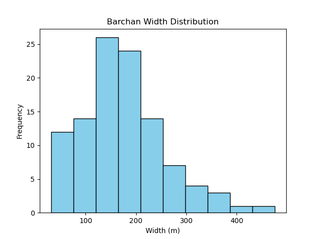
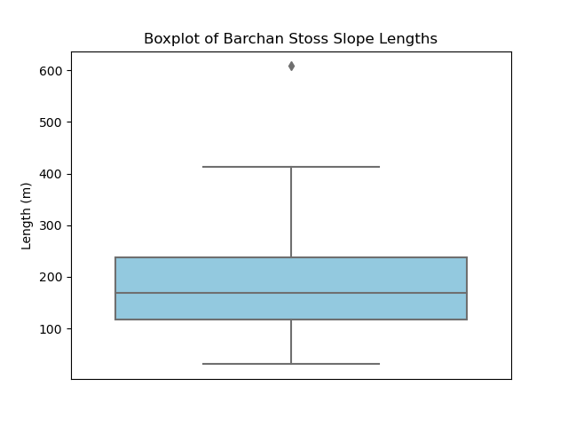
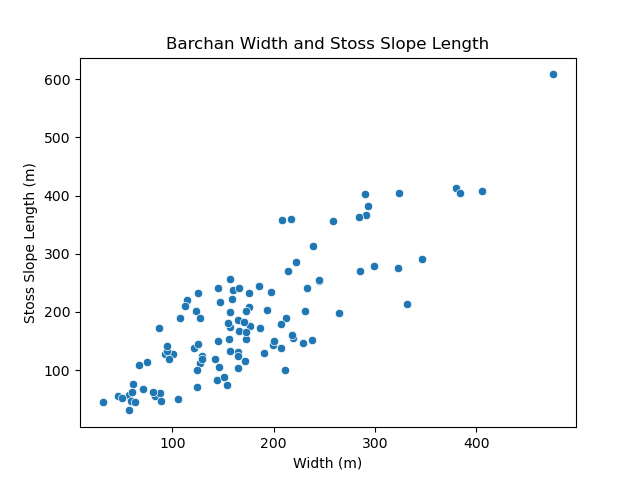
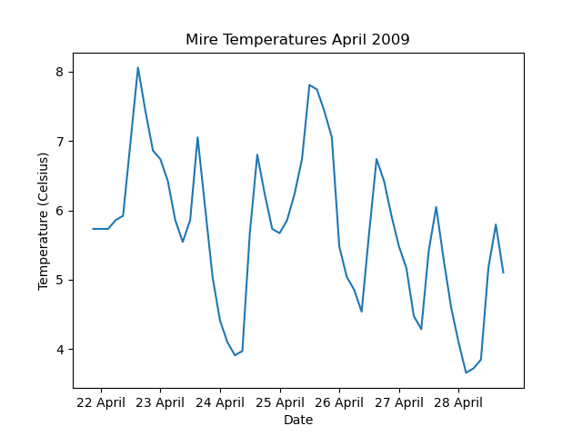
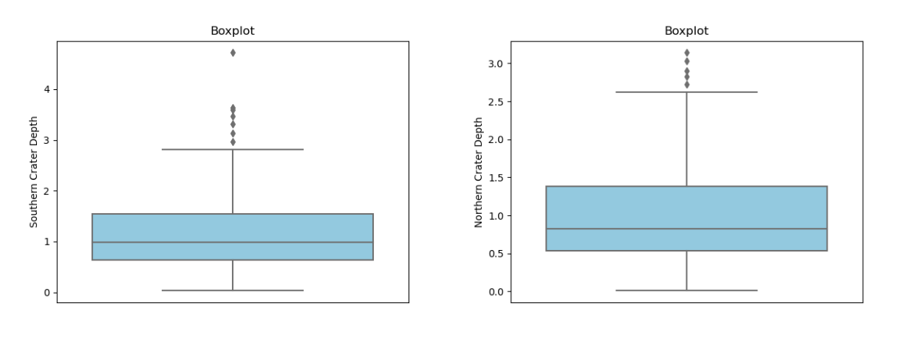

[[Training Schedule]]

## Session 1: Exploratory data analysis
### Summary statistics
For this part of the module we will be looking at a data set on craters from Mars.

```
>>> import pandas as pd
>>> import numpy as np
>>> from scipy import stats

>>> mars_craters = pd.read_csv("mars_craters.csv")
>>> mars_craters.info()
<class 'pandas.core.frame.DataFrame'>
RangeIndex: 384343 entries, 0 to 384342
Data columns (total 6 columns):
 #   Column    Non-Null Count   Dtype  
---  ------    --------------   -----  
 0   id        384343 non-null  object 
 1   name      384343 non-null  object 
 2   lat       384343 non-null  float64
 3   long      384343 non-null  float64
 4   diameter  384343 non-null  float64
 5   depth     384343 non-null  float64
dtypes: float64(4), object(2)
memory usage: 17.6+ MB
```
#### Mean
A measure of the central tendency of data that can only be applied to interval data and can be considered to represent the center of gravity of the data ([[Ebdon1985]]). It has the following formula ([[Ebdon1985]]): $$\bar{x}=\frac{\Sigma x}{n}$$
```
# calculate the mean crater diamter
>>> np.mean(mars_craters["diameter"])
3.5566863973065725

# calculate the mean crater depth
>>> np.mean(mars_craters["depth"])
0.07583754615018357
```
#### Median
The median is also a measure of central tendency and can be viewed as the "middle" of the data when all of the values are arranged in order ([[Ebdon1985]]). It is the value that splits the data in half with half of the data being lower than this value and the other half of the data being higher than this value ([[Rogerson2003]]). If the data is even, the median is then the mean between the two values that are in the middle of the data ([[Rogerson2003]]).

```
# calculate the median crater diameter
>>> np.median(mars_craters["diameter"])
1.53

# calculate the median crater depth
>>> np.median(mars_craters["depth"])
0.0
```
#### Mode
Also a measure of central tendency, the mode of a dataset is the value within the dataset that occurs most frequently ([[Ebdon1985]]). However, it may not always be useful since any specific value may not occur more than once ([[Ebdon1985]]). To obtain the mode, we need to use the mode function from the Scipy package. The output of this function is an array that contains the value of the mode and the number of times it occurs within the dataset.

```
# determine the mode (if any) of crater diameters
>>> mode_diameter = stats.mode(mars_craters["diameter"])
>>> mode_diameter
ModeResult(mode=array([1.01]), count=array([6298])) # the value of 1.01 occurs 6298 times
>>> mode_diameter[0][0]
1.01

# determine the mode (if any) of crater depth
>>> mode_depth = stats.mode(mars_craters["depth"])
>>> mode_depth
ModeResult(mode=array([0.]), count=array([307529]))
>>> mode_depth[0][0]
0.0

```
#### Variance
Measures of dispersion provide an indication of spread out the data is ([[Ebdon1985]]). It serves as a way to qualify the results obtained from measures of central tendency since the interpretive value of these may not be useful if the data is very dispersed ([[Ebdon1985]]). The variance, also referred to as the mean squared deviation (Ebdon1985), of a data set can be considered as the average squared deviation of each of the observations from the calculated mean (Rogerson2003). The formula for variance is ([[Ebdon1985]]): $$\sigma^2 = \frac{\Sigma (x-\bar{x})^2}{n}$$
```
# calculate the variance of the crater diameters
>>> np.var(mars_craters["diameter"])
73.82214773087027

# calculate the variance of the crater depths
>>> np.var(mars_craters["depth"])
0.04906988488095598
```
#### Standard deviation
The standard deviation is the square root of the variance ([[Ebdon1985]]). It has the benefit of reporting variance on the same scale as that of the data ([[Rogerson2003]]) since it removes the squared value used in the variance. This makes it easier to interpret the dispersion of the data. The formula for standard deviation is ([[Ebdon1985]]): $$\sigma = \sqrt{\frac{\Sigma (x-\bar{x})^2}{n}}$$
```
# calculate the standard deviation in diameter for craters on Mars
>>> np.std(mars_craters["diameter"])
8.591981595119385

# calculate the standard deviation in depth for craters on Mars
>>> np.std(mars_craters["depth"])
0.22151723382381783
```
#### Range
Simply put the range of a dataset is the difference between its lowest and highest value ([[Ebdon1985]]). It is the simplest measure of dispersion but can also be misleading ([[Ebdon1985]]) since it is susceptible to the effects of outliers in the data.

```
# calculate the range in diameters
>>> max_diameter = np.max(mars_craters["diameter"])
>>> min_diameter = np.min(mars_craters["diameter"])
>>> max_diameter - min_diameter
1163.22

# calculate the range in diameters
>>> max_depth = np.max(mars_craters["depth"])
>>> min_depth = np.min(mars_craters["depth"])
>>> max_depth - min_depth
5.37
```
#### Percentiles
The percentile divides the data into 100 equal portions which makes it possible to determine how much of the data is above or below a certain limit ([[Oluleye2023]]). The $k^{th}$ percentile is defined as the value that holds $k\%$ of the values below it ([[D'Agostino2006]]). In other words, the $70^{th}$ is the value where 70% of the observations occur below this value.

| Percentile | % obs. below | % obs. above |
| ---------- | ------------ | ------------ |
| 10         | 10           | 90           |
| 20         | 20           | 80           |
| 30         | 30           | 70           |
| 40         | 40           | 60           |
| 50         | 50           | 50           |
| 60         | 60           | 40           |
| 70         | 70           | 30           |
| 80         | 80           | 20           |
| 90         | 90           | 10           |
| 100        | 100          | 0            |

```
# calculate the 90th percentile for crater diameter
>>> np.percentile(mars_craters["diameter"], 90)
6.3

# calculate the 10th percentile for crater depth
>>> np.percentile(mars_craters["depth"], 10)
0.0
```
#### Quartiles
Quartiles are similar to percentiles except that the data is divided into four equal portions ([[Oluleye2023]]). The first quartile, for example, is the sample value that contains 25% of the observations at or below it ([[D'Agostino2006]]).

| Quartile | % obs. below | %  obs. above |
| -------- | ------------ | ------------- |
| 1        | 25           | 75            |
| 2        | 50           | 50            |
| 3        | 75           | 25            |
```
# calculate the first quartile for crater diameter
>>> np.quantile(mars_craters["diameter"], 0.25)
1.18

# calculate the third quartile for crater depth
>>> np.quantile(mars_craters["depth"], 0.75)
0.0
```
#### Interquartile Range (IQR)
The interquartile range is the difference between the third and the first quartiles ([[D'Agostino2006]]). Essentially, it represents the "middle half" of the dataset ([[Ebdon1985]]). This helps, to some extent, to compensate for the shortcomings of the range calculation by eliminating the influence of unusually high or low data points ([[Ebdon1985]]).

```
# calculate the iqr for crater diameter
>>> stats.iqr(mars_craters["diameter"])
1.3699999999999999

# calculate the iqr for crater depth
>>> stats.iqr(mars_craters["depth"])
0.0
```
#### Skewness
Skewness measures the asymmetry present within the data ([[Rogerson2003]]). In other words, it measures the extent to which observations in a dataset are concentrated to one side or the other of the mean ([[Ebdon1985]]). Positive skewness occurs when there are more observations below the mean than above it, while negative skewness indicates more values above the mean than below it ([[Rogerson2003]]).

```
# calculate the skewness for the crater diameter data
>>> stats.skew(mars_craters["diameter"])
23.526417889791674

# calculate the skewness for the crater depth data
>>> stats.skew(mars_craters["depth"])
4.4331487434685535
```
#### Kurtosis
Kurtosis is a measure of how peaked the histogram of the data is ([[Rogerson2003]]). In other words, kurtosis gives an indication of how concentrated the observations are in one part of the frequency distribution ([[Ebdon1985]]). If the histograms are relatively flat (i.e. the observations are distributed across the frequency intervals), they have low kurtosis (<3.0) and are said to be platykurtic ([[Rogerson2003]],[[Ebdon1985]]). In contrast, if the histograms are very peaked (i.e. the observations are very concentrated in one region of the frequency distribution), the have high (>3.0) kurtosis values and are described as leptokurtic ([[Rogerson2003]],[[Ebdon1985]]).

```
# calculate the kurtosis for the crater diameter data
>>> stats.kurtosis(mars_craters["diameter"])
1901.0414693566263

# calculate the kurtosis for the crater depth data
>>> stats.kurtosis(mars_craters["depth"])
26.74405248369471
```
### Data visualization
#### Histogram
Histograms are visual tools that can be used to summarize data ([[Rogerson2003]]). In a histogram, the values along the x-axis represent the categories into which the data was divided while the y-axis (i.e. the height of the bar) represents the number of observations in that category ([[Rogerson2003]]).

```
# import the matplotlib and seaborn libraries
>>> import seaborn as sns
>>> import matplotlib.pyplot as plt

# load the barchan-dimensions-hamdan2016.csv file
>>> barchan_dims = pd.read_csv("barchan-dimensions-hamdan2016.csv")
>>> barchan_dims.info()
<class 'pandas.core.frame.DataFrame'>
RangeIndex: 106 entries, 0 to 105
Data columns (total 2 columns):
 #   Column  Non-Null Count  Dtype
---  ------  --------------  -----
 0   width   106 non-null    int64
 1   stoss   106 non-null    int64
dtypes: int64(2)
memory usage: 1.8 KB

# construct a histogram of the dune width data
plt.hist(barchan_dims["width"], bins=10, color = "skyblue", edgecolor = "black")
plt.xlabel("Width (m)")
plt.ylabel("Frequency")
plt.title("Barchan Width Distribution")
plt.show()
```



#### Boxplots
 Data can also be summarized using boxplots ([[Rogerson2003]]) by providing the following information ([[Jaisingh2006]]):
1. The minimum value
2. The lower quartile (quartile 1)
3. The median value
4. The upper quartile (quartile 3), and
5. The maximum value

The horizontal line running through the boxplot rectangle denotes the median ([[Rogerson2003]]). The bottom and top horizontal lines of the rectangle indicate the first and third quartiles respectively ([[Rogerson2003]]). The "whiskers" that extend beyond the rectangle indicate the minimum and maximum values that correspond to $1.5\times IQR$ ([[Rogerson2003]]). If there are any outliers in the data, they are indicated individually and are placed beyond the whiskers ([[Rogerson2003]]).

```
# create a boxplot using the stoss lope data

>>> boxplot = sns.boxplot(y = "stoss", data = barchan_dims, color = "skyblue")
>>> boxplot.tick_params(bottom = False)
>>> boxplot.set_title("Boxplot of Barchan Stoss Slope Lengths")
>>> boxplot.set_ylabel("Length (m)")
>>> plt.show()
```


#### Scatterplot
During exploratory data analysis, it is often useful to explore relationships between variables in order to decide and plan strategies to be implemented during hypothesis testing. A scatterplot is a two-dimensional graph that shows the relationship between two different variables ([[Jaisingh2006]]), where each axis corresponds to one variable ([[Rogerson2003]]). Note that the scatterplot does not return an indication of a strong a relationship is (if one exists), but it can give a visual indication of a possible relationship.

```
# use a scatterplot to see if there is a potential relationship
# between dune width and stoss slope length

scatterplot = sns.scatterplot(x = "width", y = "stoss", data = barchan_dims)
scatterplot.set_title("Barchan Width and Stoss Slope Length")
scatterplot.set_xlabel("Width (m)")
scatterplot.set_ylabel("Stoss Slope Length (m)")
plt.show()
```

#### Lineplot
Lineplots are a useful tool to investigate data, particularly time-sries data.

```
# plot the mire temperatue data in the mire-temps.csv data 

>>> mire_temp = pd.read_csv("mire-temps.csv")
>>> mire_temp.info()
<class 'pandas.core.frame.DataFrame'>
RangeIndex: 56 entries, 0 to 55
Data columns (total 2 columns):
 #   Column  Non-Null Count  Dtype  
---  ------  --------------  -----  
 0   date    56 non-null     object 
 1   temp    56 non-null     float64
dtypes: float64(1), object(1)
memory usage: 1.0+ KB

>>> sns.lineplot(x = "date", y = "temp", data = mire_temp)
>>> plt.xticks([1,9,17,25,33,41,49],["22 April", "23 April", "24 April", "25 April", "26 April", "27 April", "28 April"])
>>> plt.title("Mire Temperatures April 2009")
>>> plt.xlabel("Date")
>>> plt.ylabel("Temperature (Celsius)")
>>> plt.show()
```



---
## Session 2: Hypothesis testing
#### t-Test
The t-Test is a parametric test for the difference between two samples ([[Ebdon1985]]) based on their means ([[Rogerson2003]]). It is only suitable for data that are on the interval scale ([[Ebdon1985]]). The null hypothesis of the t-Test holds that the two samples are random samples from a common, normally distributed population ([[Ebdon1985]]).

To demonstrate the code used for this type of test, the `mars-craters-subset.csv` data is used. This is a subset of the data used earlier containing only the named craters that have a depth that is not reported as 0. The goal of the test is to determine whether there is a significant difference in the depth of craters between the northern and southern hemispheres. From the results we can see that the p-value is 0.0004 which indicates that there is a significant difference between the depth of the craters in the northern hemisphere and the depth of the craters in the southern hemisphere (see table below for a guide on how to interpret p-values (based on [[Jaisingh2006]])).

The results of the `stats.ttest_ind()` function is an object used by the Scipy package called a `TtestResult`. If we assign this object to a variable, we can then extract the p-value as an attribute of the object.

| p-value                 | Interpretation                                         |
| ----------------------- | ------------------------------------------------------ |
| > 0.1                   | Little evidence for rejecting the null hypothesis      |
| 0.05 < p-value <= 0.1   | Some evidence for rejecting the null hypothesis        |
| 0.01 < p-value <= 0.05  | Moderate evidence for rejecting the null hypothesis    |
| 0.001 < p-value <= 0.01 | Strong evidence for rejecting the null hypothesis      |
| <=0.001                 | Very strong evidence for rejecting the null hypothesis |

```
>>> import pandas as pd
>>> from scipy import stats

>>> crater_data = pd.read_csv("mars-craters-subset.csv")
>>> crater_data.info()
<class 'pandas.core.frame.DataFrame'>
RangeIndex: 897 entries, 0 to 896
Data columns (total 5 columns):
 #   Column    Non-Null Count  Dtype  
---  ------    --------------  -----  
 0   name      897 non-null    object 
 1   lat       897 non-null    float64
 2   long      897 non-null    float64
 3   diameter  897 non-null    float64
 4   depth     897 non-null    float64
dtypes: float64(4), object(1)
memory usage: 35.2+ KB

# extract craters in the northern hemisphere

>>> craters_north = crater_data[crater_data["lat"]>0]
>>> craters_north.info()
<class 'pandas.core.frame.DataFrame'>
Int64Index: 368 entries, 529 to 896
Data columns (total 5 columns):
 #   Column    Non-Null Count  Dtype  
---  ------    --------------  -----  
 0   name      368 non-null    object 
 1   lat       368 non-null    float64
 2   long      368 non-null    float64
 3   diameter  368 non-null    float64
 4   depth     368 non-null    float64
dtypes: float64(4), object(1)
memory usage: 17.2+ KB

# extract craters in the southern hemisphere

>>> craters_south = crater_data[crater_data["lat"]<0]
>>> craters_south.info()
<class 'pandas.core.frame.DataFrame'>
Int64Index: 529 entries, 0 to 528
Data columns (total 5 columns):
 #   Column    Non-Null Count  Dtype  
---  ------    --------------  -----  
 0   name      529 non-null    object 
 1   lat       529 non-null    float64
 2   long      529 non-null    float64
 3   diameter  529 non-null    float64
 4   depth     529 non-null    float64
dtypes: float64(4), object(1)
memory usage: 24.8+ KB

# use the t-Test to test for signifcant difference in crater depth
>>> stats.ttest_ind(craters_north["depth"], craters_south["depth"])
Ttest_indResult(statistic=-3.527927758917055, pvalue=0.00044012958703953774)

# assign results to a variable and extract the p-value as an attribute
>>> crater_depth_ttest = stats.ttest_ind(craters_north["depth"], craters_south["depth"])
>>> crater_depth_ttest.pvalue
0.00044012958703953774
```


#### Mann-Whitney U test
This test is the non-parametric equivalent of the t-Test ([[Ebdon1985]]). Because it is a non-parametric test, it does not make any assumptions regarding the underlying distribution of the data ([[Ebdon1985]]) (i.e. it does not require that the data be normally distributed). It is applicable to ordinal data (note that interval data can be converted to ordinal data) ([[Ebdon1985]]). The null hypothesis of this test is that the data are taken from a common population and that no significant difference should therefore exist ([[Ebdon1985]]).

As a demonstration, we will use the same data as for the t-Test, but instead of testing for differences in depth we will test for differences in diameter between the two hemispheres.

```
# test for a significant difference in crater diameter between the
# northern and southern hemispheres on Mars

>>> crater_diamter_mwu = stats.mannwhitneyu(craters_north["diameter"], craters_south["diameter"])
>>> crater_diamter_mwu.pvalue
7.620404875825216e-21 # there is a significant difference
```
#### Correlation
Correlation tests are used to determine whether or not there exists a statistical association between two variables ([[Jaisingh2006]]). It can provide information regarding the strength and the direction of such a relationship ([[Ebdon1985]]). However, the presence of a correlation does not imply the presence of causation.

A parametric test for correlation is the Pearson correlation coefficient, while the non-parametric equivalent is the Spearman correlation coefficient ([[Ebdon1985]]). The strength of the correlation can range from 0 to 1 with a + or - sign indicating the direction. The table below ([[Jaisingh2006]]) can be used as a guide on how to interpret the strength of the correlation:

| Coefficient      | Interpretation                        |
| ---------------- | ------------------------------------- |
| −1 ≤ r ≤ −0.8    | Strong negative correlation.          |
| −0.79 ≤ r ≤ −0.6 | Moderately high negative correlation. |
| −0.59 ≤ r ≤ −0.4 | Moderate negative correlation.        |
| −0.39 ≤ r ≤ −0.2 | Low negative correlation.             |
| −0.19 ≤ r ≤ 0.19 | Little or no correlation.             |
| 0.2 ≤ r ≤ 0.39   | Low positive correlation.             |
| 0.4 ≤ r ≤ 0.59   | Moderate positive correlation.        |
| 0.6 ≤ r ≤ 0.79   | Moderately high positive correlation. |
| 0.8 ≤ r ≤ 1      | Strong positive correlation.          |

```
# test for a correlation between crater depth and crater diameter using the
# pearson correlation coefficient

>>> crater_depth_diameter_pearson = stats.pearsonr(crater_data["diameter"], crater_data["depth"])
>>> crater_depth_diameter_pearson.correlation
0.5057110108325387 # Moderate positive correlation.
>>> crater_depth_diameter_pearson.pvalue
2.0723053596932646e-59 # Very strong evidence for rejecting the null hypothesis

# test for a correlation between crater depth and crater diameter using the
# pearson correlation coefficient

>>> crater_depth_diameter_spearman.correlation
0.5057110108325387 # Moderate positive correlation.
>>> crater_depth_diameter_spearman.pvalue
2.0723053596932646e-59 # Very strong evidence for rejecting the null hypothesis
```
#### Linear regression
Regression analysis is a broad category in statistics that seeks to find a line that best describes the relationship between two variables ([[Jaisingh2006]]). Essentially, it is a measure of the extent to which one variable is dependent on another variable ([[Ebdon1985]]). The end result of a regression analysis is an equation (of the form $y = mc + c$) whereby one variable can be used to predict another variable ([[Ebdon1985]]). In this case, the variable that is on the x-axis is used to predict the variable that is on the y-axis. The coefficient of determination ($R^2$) is an indication of how certain one can be when making predictions when using the line of best fit ([[Jaisingh2006]]). The higher this value, the more accurately the linear model represents the relationship between the two variables. This value is calculated as the square of the `rvalue` (which is the Pearson correlation coefficient) attribute returned by the `linregress` function.

```
# determine if the depth of a crater is dependent on its diameter.

>>> depth_diamter_linregress = stats.linregress(x = crater_data["diameter"], y = crater_data["depth"])
>>> depth_diamter_linregress.pvalue
2.072305359692995e-59

# how certain can we be in predicting depth based on diamter?
>>> depth_diamter_linregress.rvalue**2
0.25574362647726817
```

### Using OOP
Earlier we briefly discussed what objects in Python are and how we can create our own class of objects. Below is an example of how we can use this to perform statistical analysis. The reasoning is as follows. Suppose we want to perform a range of statistical analyses on the data. We will quickly run into a situation where we have a large number of variables that we need to keep track of (one for each statistical test we carried out). If we apply this to several different datasets then the number of variables will quickly reach a point where we can no longer recall which variable refers to what. So instead of following this approach (which is often referred to as the Procedural Paradigm), we are going to create a new class for our data. Within this class, we will add methods that correspond to the different statistical tests that we carried out. The names of the columns and the results of the statistical tests are saved as attributes of the object. This allows us to create instances of this object that represent the dataset itself and we can access the attributes of that object to retrieve the statistical test.

```
import numpy as np
from scipy import stats
import matplotlib.pyplot as plt
import seaborn as sns
import pandas as pd

class XY_data:
    def __init__(self, x, y, x_name, y_name):
        self.x = x
        self.y = y
        self.x_name = x_name
        self.y_name = y_name
```

Here, we create a new object class that is simply called `XY_data`. This class requires the following information in order to be instantiated: columns of x and y values, and names for the x and y columns. To make it accessible, we can save it in its own file (`my_classes.py`). To create this object in a script, this file needs to be imported into our new script:

```
import pandas as pd
from my_classes import XY_data


crater_data = pd.read_csv("mars-craters-subset.csv")
craters_north = crater_data[crater_data["lat"]>0]
craters_south = crater_data[crater_data["lat"]<0]

crater_depth = XY_data(x = craters_north["depth"],
                       y = craters_south["depth"],
                       x_name = "Northern Crater Depth",
                       y_name = "Southern Crater Depth")
```

A new `XY_data` instance named `crater_depth` has been created that contains data on the crater depths of the northern and southern hemisphere on mars. Each column has also been assigned a custom heading which will be useful when we create plots later on. If we pass the variable `crater_depth` to the `type()` function, it returns `<class 'my_classes.XY_data'>` which is the file and the class we just created.  Before we can start to perform statistical tests, the methods need to be created.

```
class XY_data:
    def __init__(self, x, y, x_name, y_name):
        self.x = x
        self.y = y
        self.x_name = x_name
        self.y_name = y_name

    def x_mean(self):
        self.x_mean_value = np.mean(self.x)

    def y_mean(self):
        self.y_mean_value = np.mean(self.y)

    def means(self):
        self.x_mean()
        self.y_mean()

    def x_median(self):
        self.x_median_value = np.median(self.x)

    def y_median(self):
        self.y_median_value = np.median(self.y)

    def medians(self):
        self.x_median()
        self.y_median()
        
    def all_results(self):
        df = pd.DataFrame()
        test_name = [f"Mean ({self.x_name})",
                     f"Mean ({self.y_name})",
                     f"Median ({self.x_name})",
                     f"Median ({self.y_name})"]
        test_results = [self.x_mean_value, self.y_mean_value,
                        self.x_median_value, self.y_median_value]
        df["Test Name"] = pd.Series(test_name)
        df["Results"] = pd.Series(test_results)
        return df
        
    def y_boxplot(self, plot_title = "Boxplot"):
        boxplot = sns.boxplot(y = self.y,
                              color = "skyblue")
        boxplot.tick_params(bottom = False)
        boxplot.set_title(plot_title)
        boxplot.set_ylabel(self.y_name)
        plt.show()

    def x_boxplot(self, plot_title = "Boxplot"):
        boxplot = sns.boxplot(y = self.x,
                              color = "skyblue")
        boxplot.tick_params(bottom = False)
        boxplot.set_title(plot_title)
        boxplot.set_ylabel(self.x_name)
        plt.show()
```

In this example we have created 4 methods that return the mean and median values for each column separately. We also created two methods that will carry out the mean and median for all of the columns (these methods merely executes the other four). We also created a function that would return all of the data in a dataframe for easy use later. Lastly, we added two functions that will return boxplots for each of the columns. Running these methods on our object results in the following:

```
# Script

crater_depth.means()
crater_depth.medians()
results = crater_depth.all_results()
print(results)

# Terminal

                        Test Name   Results
0    Mean (Northern Crater Depth)  0.977092
1    Mean (Southern Crater Depth)  1.134272
2  Median (Northern Crater Depth)  0.825000
3  Median (Southern Crater Depth)  0.990000
```

And for the boxplots:

```
# Script
crater_depth.y_boxplot()
crater_depth.x_boxplot()
```



What would normally take about 23 lines of code can now be achieved in 6 lines of code. This is a substantial saving in terms of writing code. And, the main benefit, the methods in the object can be reused on other datasets without modifying the code. Yes, it does take an initial investment of time to write all of the methods the first time, but the benefit is that this is a once-off investment of time. Afterwards, the methods can be reused. It also removes the need to copy and paste code across your script. This practice of duplicating code (considered to be bad practice) makes it difficult to maintain your code. Say, for example, you realized that you omitted or incorrectly used a parameter to perform a certain statistical test. If you copied and pasted your code across your script, you will have to go to each line where this was done and make the correction (and hope you did it right the first time around). The same goes for a situation where you want to change the titles of the boxplots. However, if you follow an OOP approach like above, you just need to go to the class definition you created and correct the code in one place.

An additional benefit is that you can also more easily make changes to the script you are running. Suppose I want to change the names of the columns from `Northern Crater Depth` and `Southern Crater Depth` to `N. Crater Depth (km)` and `S. Crater Depth (km)`. If I was following a procedural paradigm, I would have to go the function were I created the names of the dataframe columns and change it there. This can be very time consuming if I have a lot of categories. Also, we will have to change it for each of the boxplots separately. But, using the OOP approach we simply have to change the script in one place: where we instantiated it.

```
crater_depth = XY_data(x = craters_north["depth"],
                       y = craters_south["depth"],
                       x_name = "N. Crater Depth (km)",
                       y_name = "S. Crater Depth (km)")
```

And then rerun the remainder of the script without making any changes. This will return the updated values automatically.

```
                       Test Name   Results
0    Mean (N. Crater Depth (km))  0.977092
1    Mean (S. Crater Depth (km))  1.134272
2  Median (N. Crater Depth (km))  0.825000
3  Median (S. Crater Depth (km))  0.990000
```


