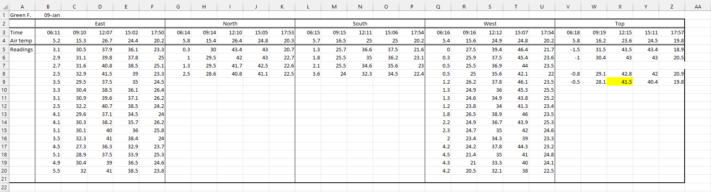
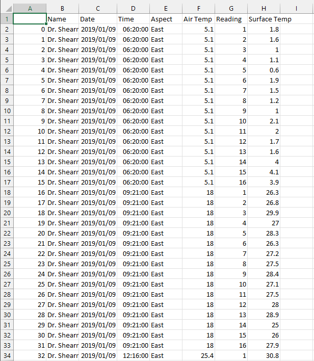

[[Training Schedule]]
## Session 1

### Data Wrangling
Data wrangling s the process of taking raw data and transforming it into something that can be used to generate meaning and insight ([[McGregor2022]]). In essence, it involves transforming the data in such a way that it is easier to use software, such as Python, to carry out analysis on that data. Data cleaning involves the transformation of raw data into clean data.
Clean data, in turn, can be described as data that is ([[McGregor2022]]) free from errors such as:
1. Typos
2. Mismatched units
3. Multiple spellings of the same word
4. Fields that are not well separated
5. Missing or impossible values

Structured data is data that has been organized in some kind of way into a format that correspond to records and fields, such as rows and columns ([[McGregor2022]]). In contrast, unstructured data can consist of a mash-up of different data types (e.g. images, text and numbers) ([[McGregor2022]]) that do not have a structures that can be easily extracted into record and fields.

### Case Study
To illustrate the process of data wrangling, we will be focusing on transforming data into a structured format (essentially, we will be cleaning a real dataset that was collected by a student of mine many years ago.)

### Raw data
The data consist of temperature readings taken on different aspects of a tombstone. The following data is available on the spreadsheet:
1. The name of the person on the tombstone (used to keep track of tombstones)
2. The date on which the readings were taken.
3. The aspect on which the readings were taken
4. The time at which the readings were taken
5. The air temperature at the time the readings were taken.
6. Multiple temperature readings of the surface.

The data is in the form of an `.xlsx` file and a screenshot is given below:



#### Goal
Although the data is somewhat structured, it is not in a form that makes it easy to analyze using Python. The foal, therefore, is to clean his data and make it more structured. Although it may be tempting to just do this in excel, the total dataset is distributed over 13 MS Excel files. Therefore, a Python script will need to be written that will loop over all the relevant files to extract the data into a single pandas dataframe. The final dataframe should resemble the one below:

| Name     | Date       | Time  | Aspect | Air Temperature | Reading No. | Surface Temperature |
| -------- | ---------- | ----- | ------ | --------------- | ----------- | ------------------- |
| Green F. | 2019/01/09 | 06:11 | East   | 5.2             | 1           | 3.1                 |
For this example, we will only be extracting the data for the eastern aspect of this file.
#### Let's get started
##### Loading the file
Since we are working with MS Excel files, we need to use the `.xlsx` library to be able to read `.xlsx` files into Python.
```
import openpyxl
```
Now we can load the file that we will be testing the our code on into Python. In openpyxl this is done by loading the MS Excel workbook (a workbook is just the term used natively by MS Excel to refer to the collection of sheets that form part of the document) and specifying which sheet we want to use. The required data is all located in the first sheet for each workbook.

```
# Script
filename = "Green F. 01-09.xlsx"

# load the workbook as an openpyxl object

workbook = openpyxl.load_workbook(filename)
print(workbook.sheetnames)
sheet = workbook.worksheets[0]

# Terminal
['Green. F 01-09']
```

The function `print(workbook.sheetnames)` returns a Python list containing an item for each sheet in the workbook. Here, there is only a single sheet (named `['Green. F 01-09']`). Although we can use this to extract information from the worksheet, the other worksheets might have different names which will make our code return an error if we attempt to apply it to other files. Therefore, we will access the sheets using an index value. The `openpyxl` library allows us to extract information from the MS Excel file using the column and row notation that is used by default within MS Excel (i.e. `A1` means row 1 in column A). We can also use ranges where the range `A1:B2` means all the cells starting in A1 and ending in B2 (i.e. A1, B1, A2, B2).

Since we want to take a functional approach to the project (i.e. using custom functions to make code reusable and to make the script files neater) we can create a function to open the first sheet of an uploaded `.xlsx` file. These functions will be saved to a separate script file `DataCleaningFunctions.py` for later use.

```
def get_first_sheet(filename, sheetIndex = 0):
    workbook = openpyxl.load_workbook(filename)
    sheet = workbook.worksheets[sheetIndex]
    return(sheet)
```

##### Getting the name
The name is stored in the cell `A1`, so to access this data and to store it in a variable we specify the cell location as an index value in our sheet, and the use the `value` attribute to get the value stored in that cell.

```
# Script

# extract the name of the tombstone
name = sheet["A1"].value

# Terminal
Green F.
```

And the function:

```
def get_name(filename, sheetIndex = 0, cellID = "A1"):
    sheet = get_first_sheet(filename, sheetIndex)
    name = sheet[cellID].value
    return(name)
```

##### Getting the date
The date of the observation is also stored in a single cell (`B1`) so we can use the same approach as with the name on the tombstone to access this value.

```
# Script

# extract the date
observation_date_date = sheet["B1"].value
print(observation_date)
print(type(observation_date))

# Terminal
2019-01-09 00:00:00
<class 'datetime.datetime'>
```

Unfortunately, there is a problem here when we print the variable `tombstone_date` in that it contains additional information that is incorrect (i.e. the observation was not made at midnight). We therefore need to remove the time information or, viewed differently, extract only the date information. To achieve this we need to load the `date` function from another library `datetime` in order to process this type of data.  This allows us to access the datetime attributes stored within each datetime instance.

```
# Script

from datetime import date

# extract year, month, and day data from tombstone_date
observation_date = date(observation_date.year,
                      observation_date.month,
                      observation_date.day)
print(observation_date)

# Terminal
2019-01-09
```

And the function:

```
def get_date(filename, sheetIndex = 0, cellID = "B1"):
    sheet = get_first_sheet(filename, sheetIndex)
    observation_date = sheet[cellID].value
    observation_date = date(observation_date.year,
                            observation_date.month,
                            observation_date.day)
    return(observation_date)
```

##### Extract the aspect information
In the original `.xlsx` file, the aspect data is stored in a merged cell (i.e. a range that spans five columns and one row). In `openpyxl` ranges have to be accessed in a slightly counterintuitive way. First, the cell range needs to be specified as a variable.

```
aspect_range = sheet["B2":"F2"]
```

If we print out this variable, we can see that it returns a `tuple` data structure which contains a `tuple` which, in turn, contains the different cells corresponding to that range. Note that each `tuple` that occurs within this `tuple` corresponds to a row within the `.xlsx` file. This is why the `aspect_range` variable only contains a single `tuple` since all the cells in the specified range occur in the same row. 

```
# Script
print(aspect_range)
# Terminal
((<Cell 'Green. F 01-09'.B2>, <MergedCell 'Green. F 01-09'.C2>, <MergedCell 'Green. F 01-09'.D2>, <MergedCell 'Green. F 01-09'.E2>, <MergedCell 'Green. F 01-09'.F2>),)
```

Because a `tuple` is immutable (i.e. it cannot be changed) we need to extract the data in some other way such as an index or a loop. We can use the index statement `aspect_range[0]` which will return the first item in the tuple (which is the `tuple` containing all the data for the individual cells). While this will work in our example of aspect, it will not work when the data of interest spans more than one row and we'll have to specify the index for each row as separate statements. An alternative approach is to use a loop function to loop over the `tuple` that contains the other `tuple` items, and then to loop through each of those (however many there may be) as well. So we will need to use two loops where the one is nested within the other.

```
# Script

for row in aspect_range:
    for cell in row:
        print(cell.value)

# Terminal
East
None
None
None
None
```

Here we see a peculiarity of MS Excel where the data in a merged range is stored in the first cell. In other words we do not need most of the information extracted using the range approach and we can simply pass the cell index of the first cell in the merged range (B2) to extract the data.

```
# Script

aspect = sheet["B2"].value

# Terminal
East
```

And the function:

```
def get_aspect(filename, sheetIndex = 0, cellID = "B2"):
    sheet = get_first_sheet(filename, sheetIndex)
    aspect = sheet[cellID].value
    return(aspect)
```

##### Extracting the times of observation
Unlike the aspect data, the data for the times of observations to occur within individual cells in a row. True, it is possible to extract all of those using individual index values (such as the ones we have been using for the `name`, `tombstone_date`, and `aspect` variables), but that would require more lines of code and a risk of making mistakes. Therefore, the loop option discussed earlier will be best suited here.

```
# Script

time_range = sheet["B3":"F3"]
for row in time_range:
    for cell in row:
        print(cell.value)
        
# Terminal
06:11:00
09:10:00
12:07:00
15:02:00
17:50:00
```

However, since we want to create a new dataframe using pandas, simply printing out the data is of no value. This data needs to be stored in a list (which will be later converted to a panda series). To achieve this, we need to define an empty list and the place each of the values extracted into that list using the `append()` method:

```
# Script

time = []
time_range = sheet["B3":"F3"]
for row in time_range:
    for cell in row:
        time.append(cell.value)

print(time)
print(time[0])        


# Terminal
[datetime.time(6, 11), datetime.time(9, 10), datetime.time(12, 7), datetime.time(15, 2), datetime.time(17, 50)]
06:11:00
```

And the function:

```
def get_times(filename, sheetIndex = 0, cell_start = "B3", cell_end = "F3"):
    sheet = get_first_sheet(filename, sheetIndex)
    time = []
    time_range = sheet[cell_start:cell_end]
    for row in time_range:
        for cell in row:
            time.append(cell.value)
    return(time)
```

##### Extracting air temperature data
To extract air temperature we can use the exact same approach as was used to extract the time data.

```
# Script

air_temp = []
air_temp_range = sheet["B4":"F4"]
for row in air_temp_range:
    for cell in row:
        air_temp.append(cell.value)

print(air_temp)

# Terminal
[5.2, 15.3, 26.7, 24.4, 20.2]
```

And the function:

```
def get_air_temperature(filename, sheetIndex = 0, start = "B4", end = "F4"):
    sheet = get_first_sheet(filename, sheetIndex)
    air_temp = []
    air_temp_range = sheet[start:end]
    for row in air_temp_range:
        for cell in row:
            air_temp.append(cell.value)
    return(air_temp)
```

##### Extracting the reading data
The surface temperature data is recorded in five columns (each corresponding to a time of observation). If you look back to the goal of the cleanup, we want to convert this to a single column of values and a associated column of surface temperature. Although there are different ways to approach this problem, in this example we will extract the data column by column using the same approach as for extracting the air temperature data.

```
# Script

col1_range = sheet["B5":"B20"]
col2_range = sheet["C5":"C20"]
col3_range = sheet["D5":"D20"]
col4_range = sheet["E5":"E20"]
col5_range = sheet["F5":"F20"]

col1 = []
col2 = []
col3 = []
col4 = []
col5 = []

for row in col1_range:
    for cell in row:
        col1.append(cell.value)

for row in col2_range:
    for cell in row:
        col2.append(cell.value)

for row in col3_range:
    for cell in row:
        col3.append(cell.value)

for row in col4_range:
    for cell in row:
        col4.append(cell.value)

for row in col5_range:
    for cell in row:
        col5.append(cell.value)

print(col1)
print(col2)
print(col3)
print(col4)
print(col5)

# Terminal
[3.1, 2.9, 2.7, 2.5, 3.5, 3.3, 3.1, 2.5, 4.1, 4.1, 3.1, 3.5, 4.5, 5.1, 4.9, 5.5]
[30.5, 31.1, 31.6, 32.9, 29.5, 30.4, 30.9, 32.2, 29.6, 30.3, 30.1, 32.3, 27.3, 28.9, 30.4, 32]
[37.9, 39.8, 40.8, 41.5, 37.5, 38.5, 39.6, 40.7, 37.1, 38.2, 40, 41, 36.3, 37.5, 39, 41]
[36.1, 37.8, 38.5, 39, 35, 36.1, 37.1, 38.5, 34.5, 35.7, 36, 38.4, 32.9, 33.9, 36.5, 38.5]
[23.3, 25, 25.1, 23.3, 24.5, 26.4, 26.2, 24.2, 24, 26.2, 25.8, 24, 23.7, 25.3, 24.6, 23.8]
```

Since we need to know the reading number, we can use the `len()` function to obtain the number of items within the list.

```
# Script

readings1 = len(col1)
readings2 = len(col2)
readings3 = len(col3)
readings4 = len(col4)
readings5 = len(col5)

print(readings1)
print(readings2)
print(readings3)
print(readings4)
print(readings5)

# terminal

16
16
16
16
16
```

And the function:

```
def get_surface_temp(filename, sheetIndex = 0, start1="B5", end1="B20",
                  start2="C5", end2="C20", start3="D5", end3="D20",
                  start4="E5", end4="E20", start5="F5", end5="F20"):
    sheet = get_first_sheet(filename, sheetIndex)
    col1_range = sheet[start1:end1]
    col2_range = sheet[start2:end2]
    col3_range = sheet[start3:end3]
    col4_range = sheet[start4:end4]
    col5_range = sheet[start5:end5]
    col1 = []
    col2 = []
    col3 = []
    col4 = []
    col5 = []
    for row in col1_range:
        for cell in row:
            col1.append(cell.value)

    for row in col2_range:
        for cell in row:
            col2.append(cell.value)

    for row in col3_range:
        for cell in row:
            col3.append(cell.value)

    for row in col4_range:
        for cell in row:
            col4.append(cell.value)

    for row in col5_range:
        for cell in row:
            col5.append(cell.value)
    return(col1, col2, col3, col4, col5)
```

##### Putting it all together
Now that we have functions for extracting the data we want from the `.xlsx` file, we can start to write a script for processing all of the files in our data folder. First, let's finetune the process for a single file before we loop through all of he files. In essence, our goal is to create a pandas dataframe that contain the data. Let's look at the extracted data again to get an idea of what our dataframe will look like.

```
# Script

import dataCleaningFunctions as dc
import pandas as pd

filename = "Green F. 01-09.xlsx"

# extract the desired data

name = dc.get_name(filename, 0)
obs_date = dc.get_date(filename, 0)
aspect = dc.get_aspect(filename, 0)
time = dc.get_times(filename, 0)
air_temp = dc.get_air_temperature(filename, 0)
surface_temp = dc.get_surface_temp(filename, 0)

print(name)
print(obs_date)
print(aspect)
print(time[0])
print(air_temp)
print(surface_temp[0])
print(len(surface_temp[0]))

# Terminal
Green F.
2019-01-09
East
06:11:00
[5.2, 15.3, 26.7, 24.4, 20.2]
[3.1, 2.9, 2.7, 2.5, 3.5, 3.3, 3.1, 2.5, 4.1, 4.1, 3.1, 3.5, 4.5, 5.1, 4.9, 5.5]
16
```

It is clear that, by far, our largest variable is the surface temperature variable. Sixteen measurements were collected at each time. Therefore, we know that for a single time stamp, our dataframe needs to contain 16 rows. This means that the name, date, aspect, time, and air temperature data will have to be repeated 16 times for a single time interval. Therefore, part of the dataframe will look like the following:

```
# Script

cleaned_data = pd.DataFrame(columns = ["Name",
                                       "Date",
                                       "Time",
                                       "Aspect",
                                       "Air Temp",
                                       "Reading",
                                       "Surface Temp"])

name_series = pd.Series([name]*16)
obs_date_series = pd.Series([obs_date]*16)
aspect_series = pd.Series([aspect]*16)
time_series = pd.Series([time[0]]*16)
air_temp_series = pd.Series([air_temp[0]]*16)
reading = []

for i in range(1,17):
    reading.append(i)

reading_series = pd.Series(reading)
surface_temp_series = pd.Series(surface_temp[0])

cleaned_data["Name"] = name_series
cleaned_data["Date"] = obs_date_series
cleaned_data["Time"] = time_series
cleaned_data["Aspect"] = aspect_series
cleaned_data["Air Temp"] = air_temp_series
cleaned_data["Reading"] = reading_series
cleaned_data["Surface Temp"] = surface_temp_series

print(cleaned_data)

# Terminal
        Name        Date      Time Aspect  Air Temp  Reading  Surface Temp
0   Green F.  2019-01-09  06:11:00   East       5.2        1           3.1
1   Green F.  2019-01-09  06:11:00   East       5.2        2           2.9
2   Green F.  2019-01-09  06:11:00   East       5.2        3           2.7
3   Green F.  2019-01-09  06:11:00   East       5.2        4           2.5
4   Green F.  2019-01-09  06:11:00   East       5.2        5           3.5
5   Green F.  2019-01-09  06:11:00   East       5.2        6           3.3
6   Green F.  2019-01-09  06:11:00   East       5.2        7           3.1
7   Green F.  2019-01-09  06:11:00   East       5.2        8           2.5
8   Green F.  2019-01-09  06:11:00   East       5.2        9           4.1
9   Green F.  2019-01-09  06:11:00   East       5.2       10           4.1
10  Green F.  2019-01-09  06:11:00   East       5.2       11           3.1
11  Green F.  2019-01-09  06:11:00   East       5.2       12           3.5
12  Green F.  2019-01-09  06:11:00   East       5.2       13           4.5
13  Green F.  2019-01-09  06:11:00   East       5.2       14           5.1
14  Green F.  2019-01-09  06:11:00   East       5.2       15           4.9
15  Green F.  2019-01-09  06:11:00   East       5.2       16           5.5
```

The code we have created thus far can produce the data that we need, but in its current form it only produces the data collected for one file, one aspect, and one time. So there is a lot more to do and we will need to make use of loops in order to make the functions work properly. Let's start by creating a loop to place all of the readings for each time within the dataframe. Since there are five time intervals, we will need to repeat the code five times, and remember to update the time and air temperature values during each loop.

```
# Script

for i in range(0,5):
    df = pd.DataFrame(columns = ["Name",
                                 "Date",
                                 "Time",
                                 "Aspect",
                                 "Air Temp",
                                 "Reading",
                                 "Surface Temp"])
    df["Name"] = pd.Series([name]*16)
    df["Date"] = pd.Series([obs_date]*16)
    df["Time"] = pd.Series([time[i]]*16)
    df["Aspect"] = pd.Series([aspect]*16)
    df["Air Temp"] = pd.Series([air_temp[i]]*16)
    df["Reading"] = pd.Series(reading)
    df["Surface Temp"] = pd.Series(surface_temp[i])
    cleaned_data = pd.concat([cleaned_data, df])

print(cleaned_data)
print(cleaned_data.info())

# Terminal
        Name        Date      Time Aspect  Air Temp Reading  Surface Temp
0   Green F.  2019-01-09  06:11:00   East       5.2       1           3.1
1   Green F.  2019-01-09  06:11:00   East       5.2       2           2.9
2   Green F.  2019-01-09  06:11:00   East       5.2       3           2.7
3   Green F.  2019-01-09  06:11:00   East       5.2       4           2.5
4   Green F.  2019-01-09  06:11:00   East       5.2       5           3.5
..       ...         ...       ...    ...       ...     ...           ...
11  Green F.  2019-01-09  17:50:00   East      20.2      12          24.0
12  Green F.  2019-01-09  17:50:00   East      20.2      13          23.7
13  Green F.  2019-01-09  17:50:00   East      20.2      14          25.3
14  Green F.  2019-01-09  17:50:00   East      20.2      15          24.6
15  Green F.  2019-01-09  17:50:00   East      20.2      16          23.8

[80 rows x 7 columns]
<class 'pandas.core.frame.DataFrame'>
Int64Index: 80 entries, 0 to 15
Data columns (total 7 columns):
 #   Column        Non-Null Count  Dtype  
---  ------        --------------  -----  
 0   Name          80 non-null     object 
 1   Date          80 non-null     object 
 2   Time          80 non-null     object 
 3   Aspect        80 non-null     object 
 4   Air Temp      80 non-null     float64
 5   Reading       80 non-null     object 
 6   Surface Temp  80 non-null     float64
dtypes: float64(2), object(5)
memory usage: 5.0+ KB
None
```

Using a for loop was successful in combining all of the observations for one aspect into a single dataframe. However, it does provide the data collected from multiple files. To do this, we can create a nested for loop that uses the for loop we created but, in addition, it loops over all of the files within a target directory. We can use the `os` library to get a list of all the files in the specified directory and then loop over each of those.

```
# Script

import dataCleaningFunctions as dc
import pandas as pd
import os

cleaned_data = pd.DataFrame(columns = ["Name",
                                       "Date",
                                       "Time",
                                       "Aspect",
                                       "Air Temp",
                                       "Reading",
                                       "Surface Temp"])
list_of_files = os.listdir("data-to-be-cleaned/")
list_of_paths = []
for file in list_of_files:
    path = f'data-to-be-cleaned/{file}'
    list_of_paths.append(path)
for filename in list_of_paths:
    name = dc.get_name(filename, 0)
    obs_date = dc.get_date(filename, 0)
    aspect = dc.get_aspect(filename, 0)
    time = dc.get_times(filename, 0)
    air_temp = dc.get_air_temperature(filename, 0)
    surface_temp = dc.get_surface_temp(filename, 0)
    reading = []
    for i in range(1,17):
        reading.append(i)
    for i in range(0,5):
        df = pd.DataFrame(columns = ["Name",
                                         "Date",
                                         "Time",
                                         "Aspect",
                                         "Air Temp",
                                         "Reading",
                                         "Surface Temp"])
        df["Name"] = pd.Series([name]*16)
        df["Date"] = pd.Series([obs_date]*16)
        df["Time"] = pd.Series([time[i]]*16)
        df["Aspect"] = pd.Series([aspect]*16)
        df["Air Temp"] = pd.Series([air_temp[i]]*16)
        df["Reading"] = pd.Series(reading)
        df["Surface Temp"] = pd.Series(surface_temp[i])
        cleaned_data = pd.concat([cleaned_data, df])
cleaned_data.reset_index(drop = True, inplace = True)
print(cleaned_data)
cleaned_data.to_csv("cleaned_data.csv")

# Terminal
             Name        Date      Time Aspect  Air Temp Reading  Surface Temp
0    Dr. Shearman  2019-01-09  06:20:00   East       5.1       1           1.8
1    Dr. Shearman  2019-01-09  06:20:00   East       5.1       2           1.6
2    Dr. Shearman  2019-01-09  06:20:00   East       5.1       3           1.0
3    Dr. Shearman  2019-01-09  06:20:00   East       5.1       4           1.1
4    Dr. Shearman  2019-01-09  06:20:00   East       5.1       5           0.6
..            ...         ...       ...    ...       ...     ...           ...
955      Green F.  2019-09-17  17:55:00   East      28.8      12          34.8
956      Green F.  2019-09-17  17:55:00   East      28.8      13          34.1
957      Green F.  2019-09-17  17:55:00   East      28.8      14          35.3
958      Green F.  2019-09-17  17:55:00   East      28.8      15          35.5
959      Green F.  2019-09-17  17:55:00   East      28.8      16          34.3

[960 rows x 7 columns]

```

And when we open the newly created `.csv` file that contains the cleaned data we can see that the data is structured in a way that makes it easier for carrying out analysis since we can subset the data in any way based on the question being asked.


### Data Augmentation
Data augmentation is the process whereby we expand upon a dataset by incorporating data from another source ([[McGregor2022]]). For example, in the final report of the student who collected the dataset that you are working with, they state that the times of data collection for each day correspond to: dawn, mid-morning, noon, mid-afternoon, and dusk. With only a minor modification to our code, we can incorporate this information. We add the following after our `list_of_paths` variable:

```
categories = ["dawn", "mid-morning", "noon", "mid-afternoon", "dusk"]
```

and include the following within the nested loop:

```
df["Category"] = pd.Series([categories[i]]*16)
```

The result is a dataframe that includes the category of the time observation within the data.

```
             Name        Date      Time Category Aspect  Air Temp Reading  Surface Temp
0    Dr. Shearman  2019-01-09  06:20:00     dawn   East       5.1       1           1.8
1    Dr. Shearman  2019-01-09  06:20:00     dawn   East       5.1       2           1.6
2    Dr. Shearman  2019-01-09  06:20:00     dawn   East       5.1       3           1.0
3    Dr. Shearman  2019-01-09  06:20:00     dawn   East       5.1       4           1.1
4    Dr. Shearman  2019-01-09  06:20:00     dawn   East       5.1       5           0.6
..            ...         ...       ...      ...    ...       ...     ...           ...
955      Green F.  2019-09-17  17:55:00     dusk   East      28.8      12          34.8
956      Green F.  2019-09-17  17:55:00     dusk   East      28.8      13          34.1
957      Green F.  2019-09-17  17:55:00     dusk   East      28.8      14          35.3
958      Green F.  2019-09-17  17:55:00     dusk   East      28.8      15          35.5
959      Green F.  2019-09-17  17:55:00     dusk   East      28.8      16          34.3

[960 rows x 8 columns]
```