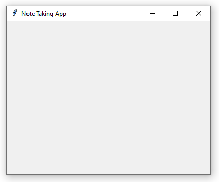
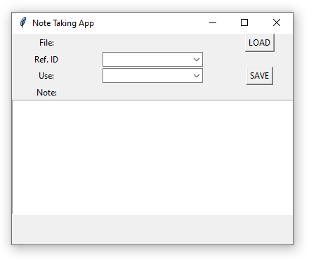

[[Training Schedule]]
## Session 1
### Tkinter components
There are three important parts to any project involving tkinter: widgets, geometry and event handline. The widgets are the objects that you see on screen ([[Roseman2020]]). Widgets are objects ([[Roseman2020]]) which means they have attributes and methods that we can use to achieve the functionality that we desire in our application. These can widgets can be used to input data, display data and to execute functions (e.g. pressing a button to run a script). An a list of the different widgets available in tkinter is provided below (for this table, the `tkinter` package was imported as `tk`. The table was adapted from [[Roseman2020]]).

| Widget      | Command            | Description                                                                                                         |
| ----------- | ------------------ | ------------------------------------------------------------------------------------------------------------------- |
| Button      | `tk.Button()`      | An interactive widget that, when pressed, performs an action.                                                       |
| Checkbutton | `tk.Checkbutton()` | An interactive widget that is used to capture a binary value.                                                       |
| Combobox    | `tk.Combobox()`    | A widget that combines an entry field with a list of choices.                                                       |
| Entry       | `tk.Entry()`       | A single line text input field.                                                                                     |
| Frame       | `tk.LabelFrame()`  | Displays a rectangle that can be used to visually organize widgets on the interface.                                |
| Label       | `tk.Label()`       | A widget that is used to display text or images.                                                                    |
| Listbox     | `tk.Listbox()`     | A widget that displays a list of single-line text items and allows users to browse through the options.             |
| Progressbar | `tk.Progressbar()` | A widget that provides the user feedback regarding the progress on a given task.                                    |
| Radiobutton | `tk.Radiobutton`   | An interactive widget that allows the user to select one of several mutually exclusive choices.                     |
| Scale       | `tk.Scale()`       | Allows the user to select a numeric value between a pre-set minimum and maximum value.                              |
| Scrollbar   | `tk.Scrollbar()`   | Allows a user to see parts of the window (or other widgets) that may be obscured due to limited screen real estate. |
| Spinbox     | `tk.Spinbox()`     | A widget that allows a user to either select a number or an item form a list.                                       |
| Text        | `tk.Text()`        | A widget that allows the user to input multiple lines of text.                                                      |

The geometry is essentially just the size and layout of the gui application. It determines how and where the widgets are displayed. Event handling "listens" for events which is typically any action carried out using either the keyboard or mouse. When a key is pressed on the keyboard or a button is pressed on the mouse, it is registered as an event. Tkinter allows you to link customized functions with such events. 

For today's session, we will be creating a notetaking app that you can use when reading through the literature. A rough outline of the app is:


Tkinter is used to create the GUI while pandas will be used to manipulate the contents of the csv file that will sore all of the notes. The `File` is the file where our notes will be stored. This file will be loaded into pandas using the `Load` button. The `Ref. ID` field is a lenel that can be used to identify the article. For example, you can use the in-text citation (e.g.  (Roseman, 2020)) as the identifier. Whatever you choose, it is important that this will allow you to identify the origin of the note (i.e. the article that is associated with this note). The `Use`  field is where you think you will be using this note. In other words, is it important for your introduction, literature review, method etc. The actual note will be entered into the `Note` field and the `Save` button will update the `.csv` file selected earlier.

### Notetaking App
#### Creating the GUI
To create our GUI we need to import the `tkinter` package. We then create an instance of an `Tk()` object that we assign to the variable `root`. Then, we use the `.title()` and the `.geometry()` methods that are associated with the object `root` to specify the title of our GUI and its size. Lastly, we need to run the `.mainloop()` method in order to be able to view the GUI. In essence, the entire GUI exists within its own infinite loop ([[Chandrakar2023]]) until an event is triggered to end the loop and exit the GUI. All of the code that needs to run while the App is open needs to be between the `root - tk.Tk()` and `root.mainloop()` commands ([[Chandrakar2023]]). Any code that is written below the `root.mainloop()` command will only be executed once the App is closed ([[Chandrakar2023]]).

```
import tkinter as tk

root = tk.Tk()

root.title("Notetaking App")
root.geometry("400x300")

root.mainloop()
```

This code will create a window that resembles the one below (the output can vary depending on the OS you are using):

#### Adding the widgets
After the window for the GUI has been created, the different widgets that will be needed can be added. Although the majority of the widgets are available using the `import tkinter` statement, some of the widgets (such as the combobox) requires an additional statement, namely `from tkinter import ttk`. 

```
import tkinter as tk
from tkinter import ttk

root = tk.Tk()

root.title("Notetaking App")
root.geometry("400x300")

# add widgets to load and display csv file
lbl_file = tk.Label(root, text='File:')
lbl_file.grid(row=0, column=0)
lbl_file_loc = tk.Label(root)
lbl_file_loc.grid(row=0, column=1)
			
			
# add widgets to select the suitable metadata for the note
lbl_id = tk.Label(root, text="Ref. ID")
lbl_id.grid(row=1, column=0)
cmb_id = ttk.Combobox(root)
cmb_id.grid(row=1, column=1)
			
lbl_use = tk.Label(root, text='Use:')
lbl_use.grid(row=2, column=0)
cmb_use = ttk.Combobox(root)
cmb_use.grid(row=2, column=1)
			
# add buttons to perfrom functions
btn_load = tk.Button(root, text="LOAD")
btn_load.grid(row=0, column=2)
			
btn_save = tk.Button(root, text="SAVE")
btn_save.grid(row=2, column=2)
			
# add note widget and label
lbl_note = tk.Label(root, text = 'Note:')
lbl_note.grid(row=3, column=0)
			
txt_note = tk.Text(root, width=50, height=10, wrap=tk.WORD)
txt_note.grid(row=4, column=0, columnspan=3)


root.mainloop()
```

Two sets of commands need to be present for any widget. The first command creates the widget and assigns in to a variable. The second command uses the `.grid()` method to place the widget within the window. The `.grid()` method requires two argument to be given: row an column. If you consider the GUI window as a spreadsheet, then the `row` argument determines the vertical placement of the widget and the `column` argument specifies its horizontal position. The App should now resemble this:

#### Creating the functions
##### load_file
The `load_file` function is the function that will be called when the `LOAD` button is pressed. The `global` statement instructs python to make these variables global (i.e. to make them accessible outside of the scope of this function). This is important since we will be using other functions to add information to the `.csv` file (which is going to be sored in the `df` variable) and we want to use another function to update the `.csv` file using its file path (which is stored in the `file_path` variable).

The `filedialog` object contains the `.askopenfilename()` method which will make it possible to access your systems' directories to select the desired file. You can specify what type of file it is allowed to search for by passing it a list of tuples for each filetype. the tuple contains two elements: the first `'CSV'` is how the file name will appear within the search window, while the second item `'*.csv'` uses the wildcard notation `*` to state than any file with a `.csv` extension is suitable.

This function will also update three other widgets: `lbl_file_loc`, `cmb_id`, and `cmb_use`. This is achieved by using the `.configure()` method for the label widget and the `.config()` method for the combobox widgets. The update to the `lbl_file_loc` widget displays the filename and its main purpose is to ensure that we are working with the correct file. The update to the `cmb_id` object is so that we don't have to retype the reference id each time but can just select one from a list. In order to achieve this, we need to determine which unique ID values are within the file. This can be done using the `.unique()` method from pandas. However, the `cmb_id` widget requires a list as an input (and remember a "list" from pandas is a Series) so the `tolist()` method is called in order to convert the output of the `.unique()` method to the appropriate data structure. The same approach is used for the intended use widget (`cmb_use`).

```
def load_file():
    global df
    global file_path
    file_path = filedialog.askopenfilename(filetypes=[('CSV', '*.csv')])
    lbl_file_loc.configure(text = file_path)
    df = pd.read_csv(file_path)
    unique_ref_id = df['ref_id'].unique().tolist()
    cmb_id.config(values=unique_ref_id)
    unique_use = df['use'].unique().tolist()
    cmb_use.config(values=unique_use)
```

##### save_note
The `save_note` function will be used to update the `.csv` file and save it to the hard drive. It therefore requires access to the dataframe variable `df` and the string variable `file_path` that was created in the `load_file` function. These variables are therefore also indicated as global variables.

This function needs to obtain the information entered (or selected) for each of the widgets in order to populate the `.csv` file. To achieve this, it makes use of the `.get()` method for the respective widgets. With the information contained within the `Note` widget, we use an additional method `.strip()` to remove all of the leading and trailing white spaces that may be present in the field. This will ensure a more neat appearance within the `.csv` file.

Next, we need to update the dataframe containing all of our notes with the new information. There are multiple ways to achieve this, but here we will use the `concat()` function from pandas. This function combines two different dataframes into a new dataframe. In essence, this can be viewed as "adding" a new dataframe at the bottom of an existing dataframe. Since the `.csv` file is stored as a pandas dataframe, this will allow us to add the new entries to the bottom of that dataframe. To achieve this, the new entries have to be in a dataframe structure. Once again, there are a couple of ways to achieve this. Here, we will store the entries into a dataframe (where the keys of the dictionary correspond to the columns of the dataframe) and the convert the dictionary into a dataframe.

We can then use the `concat()` function to combine the two dataframes. By setting the `ignore_index` argument to `False`, we are effectively ignoring the index values that are created by pandas. We do the same when saving the dataframe. If this is not done, pandas will add a new column of index values to each subsequent save which adds a lot of unnecessary information to the `.csv` file.

The `.delete()` method of the widgets is used to clear the fields so that we can add the new note. Laslty, we save the modified dataframe to using the same file path (to ensure that all of our notes remain in the same file) before reading it back into memory again as a variable. This last step ensures that the updated file is ready for when we add a new note and that the comboboxes are updated with the new information.

```
def save_note():
    global df
    global file_path
    ref_id = cmb_id.get().strip()
    use = cmb_use.get().strip()
    note = txt_note.get(1.0, tk.END).strip()
    entry = {'ref_id':[ref_id],
             'use':[use],
             'note':[note]}
    entry_df = pd.DataFrame(entry)
    df_update = pd.concat([df, entry_df], ignore_index = True)
    df_update.to_csv(file_path, index = False)
    cmb_id.delete(0, tk.END)
    cmb_use.delete(0, tk.END)
    txt_note.delete(1.0, tk.END)
    df = pd.read_csv(file_path)
    unique_ref_id = df['ref_id'].unique().tolist()
    cmb_id.config(values=unique_ref_id)
    unique_use = df['use'].unique().tolist()
    cmb_use.config(values=unique_use)
```

Now that the functions have been defined, they need to be added to the appropriate widgets (`LOAD` and `SAVE`) to ensure that they will be executed when those buttons are pressed. The completed code is then:
```
import tkinter as tk
from tkinter import ttk, filedialog
import pandas as pd

root = tk.Tk()

root.title("Notetaking App")
root.geometry("400x300")

# add functions
def load_file():
    global df
    global file_path
    file_path = filedialog.askopenfilename(filetypes=[('CSV', '*.csv')])
    lbl_file_loc.configure(text = file_path)
    df = pd.read_csv(file_path)
    unique_ref_id = df['ref_id'].unique().tolist()
    cmb_id.config(values=unique_ref_id)
    unique_use = df['use'].unique().tolist()
    cmb_use.config(values=unique_use)

def save_note():
    global df
    global file_path
    ref_id = cmb_id.get().strip()
    use = cmb_use.get().strip()
    note = txt_note.get(1.0, tk.END).strip()
    entry = {'ref_id':[ref_id],
             'use':[use],
             'note':[note]}
    entry_df = pd.DataFrame(entry)
    df_update = pd.concat([df, entry_df], ignore_index = True)
    df_update.to_csv(file_path, index = False)
    cmb_id.delete(0, tk.END)
    cmb_use.delete(0, tk.END)
    txt_note.delete(1.0, tk.END)

# add widgets to load and display csv file
lbl_file = tk.Label(root, text='File:')
lbl_file.grid(row=0, column=0)
lbl_file_loc = tk.Label(root)
lbl_file_loc.grid(row=0, column=1)
			
			
# add widgets to select the suitable metadata for the note
lbl_id = tk.Label(root, text="Ref. ID")
lbl_id.grid(row=1, column=0)
cmb_id = ttk.Combobox(root)
cmb_id.grid(row=1, column=1)
			
lbl_use = tk.Label(root, text='Use:')
lbl_use.grid(row=2, column=0)
cmb_use = ttk.Combobox(root)
cmb_use.grid(row=2, column=1)
			
# add buttons to perfrom functions
btn_load = tk.Button(root, text="LOAD", command = load_file)
btn_load.grid(row=0, column=2)
			
btn_save = tk.Button(root, text="SAVE", command = save_note)
btn_save.grid(row=2, column=2)
			
# add note widget and label
lbl_note = tk.Label(root, text = 'Note:')
lbl_note.grid(row=3, column=0)
			
txt_note = tk.Text(root, width=50, height=10, wrap=tk.WORD)
txt_note.grid(row=4, column=0, columnspan=3)


root.mainloop()

```
To use this app, create a blank `.csv` file with the following column names: **ref_id,** **use**, and **note**.